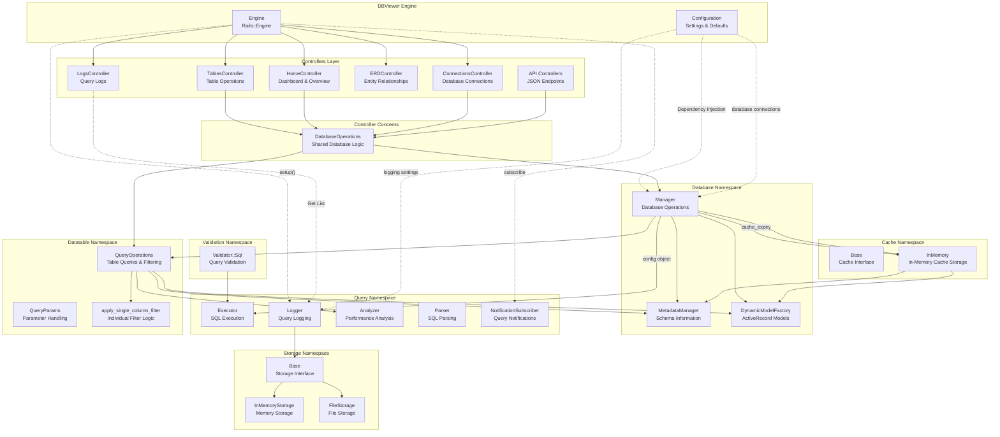

# 👁️ DBViewer

> **The fastest way to visualize and explore your database**

DBViewer is a powerful Rails engine that provides a comprehensive interface to view and explore database tables, records, and schema.
It's designed for development, debugging, and database analysis, offering a clean and intuitive way to interact with your application's database.


## ✨ Features

- **Dashboard** - Comprehensive database overview with statistics
- **Table Overview** - Complete table listing with metadata
- **Detailed Schema Information** - Column details, indexes, and constraints
- **Entity Relationship Diagram (ERD)** - Interactive database schema visualization
- **Data Browsing** - Paginated record viewing with search and filtering
- **Data Management** - Create and delete database records directly from the interface
- **SQL Queries** - Safe SQL query execution with validation
- **Multiple Database Connections** - Support for multiple database sources
- **PII Data Masking** - Configurable masking for sensitive data
- **Access Control** - Table and column-level access restrictions
- **Query Logging** - SQL query monitoring and performance analysis

## 🧪 Demo Application

You can explore a live demo of DBViewer at [https://dbviewer-demo.wailantirajoh.tech/](https://dbviewer-demo.wailantirajoh.tech/). This demo showcases all the features of DBViewer on a sample database, allowing you to try out the tool before installing it in your own application.

## 📥 Installation

Add this line to your application's Gemfile:

```ruby
gem "dbviewer"
```

And then execute:

```bash
bundle
```

## 🔧 Usage

Mount the engine in your application's `config/routes.rb` file:

```ruby
Rails.application.routes.draw do
  # Your application routes...

  # Mount the DBViewer engine
  mount Dbviewer::Engine, at: "/dbviewer"
end
```

Then, visit `/dbviewer` in your browser to access the database viewer.

### Rails API-only Applications

If you're using a Rails API-only application (created with `--api` flag), you'll need to enable the Flash middleware for DBViewer to work properly. Add the following to your `config/application.rb`:

```ruby
module YourApp
  class Application < Rails::Application
    # ... existing configuration

    # Required for DBViewer flash messages
    config.middleware.use ActionDispatch::Flash
  end
end
```

This is necessary because API-only Rails applications don't include the Flash middleware by default, which DBViewer uses for displaying notifications.

### Available Pages

- **Dashboard** (`/dbviewer`): Comprehensive overview with database statistics and analytics
- **Tables Index** (`/dbviewer/tables`): Shows all tables in your database with column counts and quick access
- **Table Details** (`/dbviewer/tables/:table_name`): Shows table structure and records with pagination
- **SQL Query** (`/dbviewer/tables/:table_name/query`): Allows running custom SQL queries
- **ERD View** (`/dbviewer/entity_relationship_diagrams`): Interactive Entity Relationship Diagram of your database
- **SQL Query Logs** (`/dbviewer/logs`): View and analyze logged SQL queries with performance metrics

## ⚙️ Configuration Options

You can configure DBViewer by using our generator to create an initializer in your application:

```bash
rails generate dbviewer:install
```

This will create a file at `config/initializers/dbviewer.rb` with the default configuration:

```ruby
# config/initializers/dbviewer.rb
Dbviewer.configure do |config|
  config.per_page_options = [10, 20, 50, 100, 250]  # Default pagination options
  config.default_per_page = 20                       # Default records per page
  config.max_query_length = 10000                    # Maximum SQL query length
  config.cache_expiry = 300                          # Cache expiration in seconds
  config.max_records = 10000                         # Maximum records to return in any query
  config.enable_data_export = false                  # Whether to allow data exporting
  config.enable_record_deletion = true               # Whether to allow record deletion
  config.query_timeout = 30                          # SQL query timeout in seconds

  # Query logging options
  config.enable_query_logging = false                # Enable or disable query logging completely (default: true)
  config.query_logging_mode = :memory                # Storage mode for SQL queries (:memory or :file)
  config.query_log_path = "log/dbviewer.log"         # Path for query log file when in :file mode
  config.max_memory_queries = 1000                   # Maximum number of queries to store in memory

  # Authentication options
  # config.admin_credentials = { username: "admin", password: "your_secure_password" } # Basic HTTP auth credentials

  # Table and Column Access Control
  # config.access_control_mode = :whitelist  # :whitelist, :blacklist, or :none (default)
  # config.allowed_tables = ['users', 'orders', 'products']  # Only these tables accessible (whitelist mode)
  # config.blocked_tables = ['admin_users', 'sensitive_data']  # These tables blocked (blacklist mode)
  # config.blocked_columns = {  # Hide sensitive columns from specific tables
  #   'users' => ['password_digest', 'api_key', 'secret_token'],
  #   'orders' => ['internal_notes']
  # }

  # Disable DBViewer completely
  # config.disabled = Rails.env.production?  # Disable in production
end
```

You can also create this file manually if you prefer.

The configuration is accessed through `Dbviewer.configuration` throughout the codebase. You can also access it via `Dbviewer.config` which is an alias for backward compatibility.

### Multiple Database Connections

DBViewer supports working with multiple database connections in your application. This is useful for applications that connect to multiple databases or use different connection pools.

To configure multiple database connections, set them up in your initializer:

```ruby
# config/initializers/dbviewer.rb
Dbviewer.configure do |config|
  # Multiple database connections configuration
  config.database_connections = {
    primary: {
      connection_class: "ActiveRecord::Base",
      name: "Primary Database"
    },
    secondary: {
      connection_class: "SecondaryDatabase",
      name: "Blog Database"
    }
  }

  # Set the default active connection
  config.current_connection = :primary
end
```

Each connection needs to reference an ActiveRecord class that establishes a database connection.

## 🪵 Query Logging (Development Only)

DBViewer includes a powerful SQL query logging system that captures and analyzes database queries. You can access this log through the `/dbviewer/logs` endpoint.

The logging system offers two storage backends:

### Disabling Query Logging

You can completely disable query logging if you don't need this feature:

```ruby
config.enable_query_logging = false       # Disable query logging completely
```

### In-Memory Storage (Default)

By default, queries are stored in memory. This provides fast access but queries are lost when the application restarts:

```ruby
config.query_logging_mode = :memory       # Store queries in memory (default)
config.max_memory_queries = 1000          # Maximum number of queries stored
```

### File-Based Storage

For persistent logging across application restarts, you can use file-based storage:

```ruby
config.query_logging_mode = :file         # Store queries in a log file
config.query_log_path = "log/dbviewer.log" # Path where query log file will be stored
```

The file format uses one JSON entry per line, making it easy to analyze with standard tools.

**Note**: Query logging is automatically disabled in non-development environments for performance.

## 🔒 Security Features

DBViewer includes comprehensive security features to protect your database:

### Core Security

- **Data Manipulation**: Create and read operations are supported through the UI with proper validation
- **SQL Validation**: Prevents potentially harmful operations with comprehensive validation
- **Query Limits**: Automatic LIMIT clause added to prevent excessive data retrieval
- **Pattern Detection**: Detection of SQL injection patterns and suspicious constructs
- **Error Handling**: Informative error messages without exposing sensitive information

### Authentication & Access Control

- **HTTP Basic Authentication**: Protect access with username and password
- **Table-Level Access Control**: Whitelist/blacklist specific tables
- **Column-Level Blocking**: Hide sensitive columns from display
- **Complete Disabling**: Fully disable DBViewer in production environments

### Basic Authentication

Enable HTTP Basic Authentication to secure access:

```ruby
Dbviewer.configure do |config|
  config.admin_credentials = {
    username: "your_username",
    password: "your_secure_password"
  }
end
```

When credentials are provided, all DBViewer routes will be protected by HTTP Basic Authentication.

### Complete Disabling for Production

For maximum security in production environments, completely disable DBViewer:

```ruby
Dbviewer.configure do |config|
  # Completely disable DBViewer in production
  config.disabled = Rails.env.production?

  # Or disable unconditionally
  # config.disabled = true
end
```

When disabled, all DBViewer routes return 404 responses, making it appear as if the tool was never installed. This is the recommended approach for production systems.

⚠️ **Security Warning**: This engine provides direct access to your database contents. In production:

- Use long, randomly generated passwords (e.g., `SecureRandom.hex(16)`)
- Access DBViewer over HTTPS connections only
- Limit access to trusted administrators only
- Consider completely disabling in production environments

### 🔐 PII Data Masking

DBViewer includes built-in support for masking Personally Identifiable Information (PII) to protect sensitive data while allowing developers to browse database contents.

Enable PII masking in your Rails initializer:

```ruby
Dbviewer.configure do |config|
  config.enable_pii_masking = true
end
```

For complete setup instructions, built-in masking types, and advanced configuration examples, see [PII_MASKING.md](docs/PII_MASKING.md).

### Table and Column Access Control

DBViewer includes granular access control features to restrict access to specific tables and columns, providing an additional layer of security beyond basic authentication.

#### Access Control Modes

DBViewer supports three access control modes:

- **`:none`** (default) - All tables are accessible
- **`:whitelist`** - Only explicitly allowed tables are accessible (most secure)
- **`:blacklist`** - All tables except explicitly blocked ones are accessible

#### Configuration Examples

```ruby
# config/initializers/dbviewer.rb
Dbviewer.configure do |config|
  # Whitelist mode (recommended for production)
  config.access_control_mode = :whitelist
  config.allowed_tables = ['users', 'orders', 'products', 'categories']

  # OR blacklist mode
  # config.access_control_mode = :blacklist
  # config.blocked_tables = ['admin_users', 'sensitive_data', 'audit_logs']

  # Hide sensitive columns from specific tables
  config.blocked_columns = {
    'users' => ['password_digest', 'api_key', 'secret_token'],
    'orders' => ['internal_notes', 'admin_comments']
  }
end
```

When access control is enabled, DBViewer will:

- Validate all table access in UI, API endpoints, and Entity Relationship Diagrams
- Filter SQL queries to prevent unauthorized table access
- Show only accessible tables and their relationships in ERDs
- Provide informative error messages for access violations

For detailed PII masking documentation, see [PII_MASKING.md](docs/PII_MASKING.md).

## 🔄 Updating DBViewer

To keep DBViewer up to date with the latest features, security patches, and bug fixes, follow these steps:

### Using Bundler

The simplest way to update is using Bundler:

- Update your Gemfile with the desired version:

  ```ruby
  # For the latest version
  gem "dbviewer"

  # Or specify a version
  gem "dbviewer", "~> 0.9.0"
  ```

- Run bundle update:

  ```ruby
  bundle update dbviewer
  ```

- Restart your Rails server to apply the changes:

  ```ruby
  rails server
  ```

## 🛠️ Development Setup

To set up the development environment for contributing to DBViewer:

### Quick Setup

Run the setup script to automatically configure your development environment:

```bash
bin/setup
```

This script will:

- Install bundler and gem dependencies
- Set up the test dummy Rails application
- Create and seed the development database
- Prepare the test environment
- Clean up old logs and temporary files

### Manual Setup

If you prefer to set up manually:

```bash
# Install dependencies
bundle install

# Set up the dummy app database
cd sample/app
bin/rails db:prepare
bin/rails db:migrate
bin/rails db:seed
cd ../..

# Prepare test environment
cd sample/app && bin/rails db:test:prepare && cd ../..
```

### Development Commands

```bash
# Start the development server
cd sample/app && bin/rails server

# Run tests
bundle exec rspec

# Run code quality checks
bin/rubocop

# Open an interactive console
bin/console

# Build the gem
gem build dbviewer.gemspec
```

### Testing Your Changes

1. Start the dummy Rails application: `cd sample/app && bin/rails server`
2. Visit `http://localhost:3000/dbviewer` to test your changes
3. The dummy app includes sample data across multiple tables to test various DBViewer features

### Architecture Diagram



## 🤌🏻 Contributing

Bug reports and pull requests are welcome.

## 📄 License

The gem is available as open source under the terms of the [MIT License](https://opensource.org/licenses/MIT).
